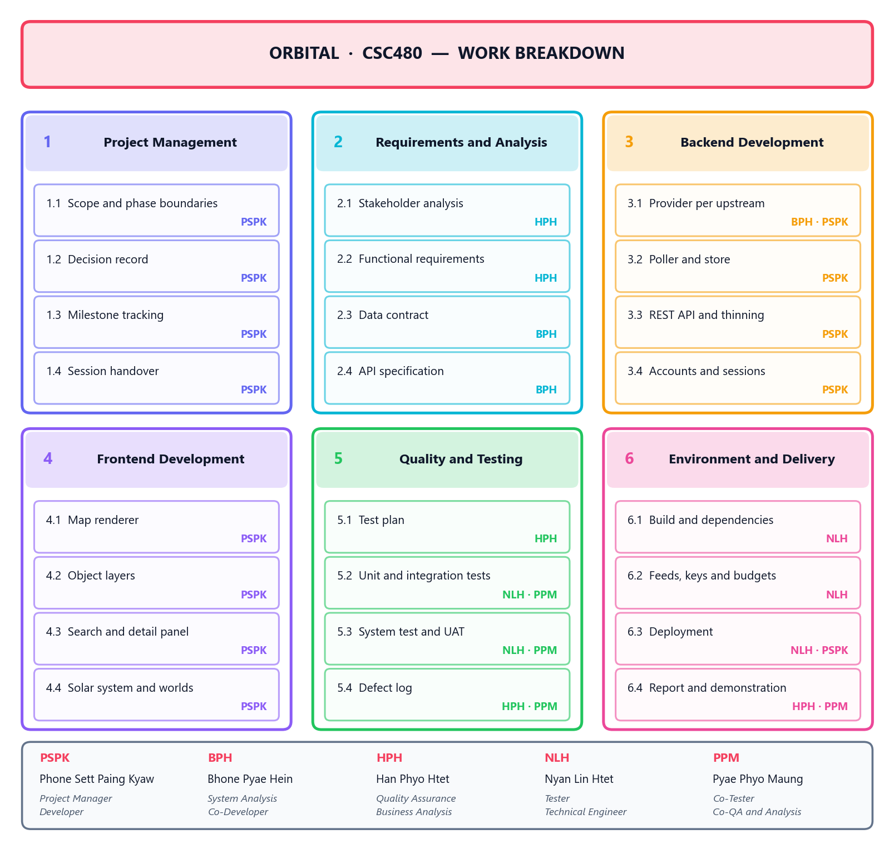
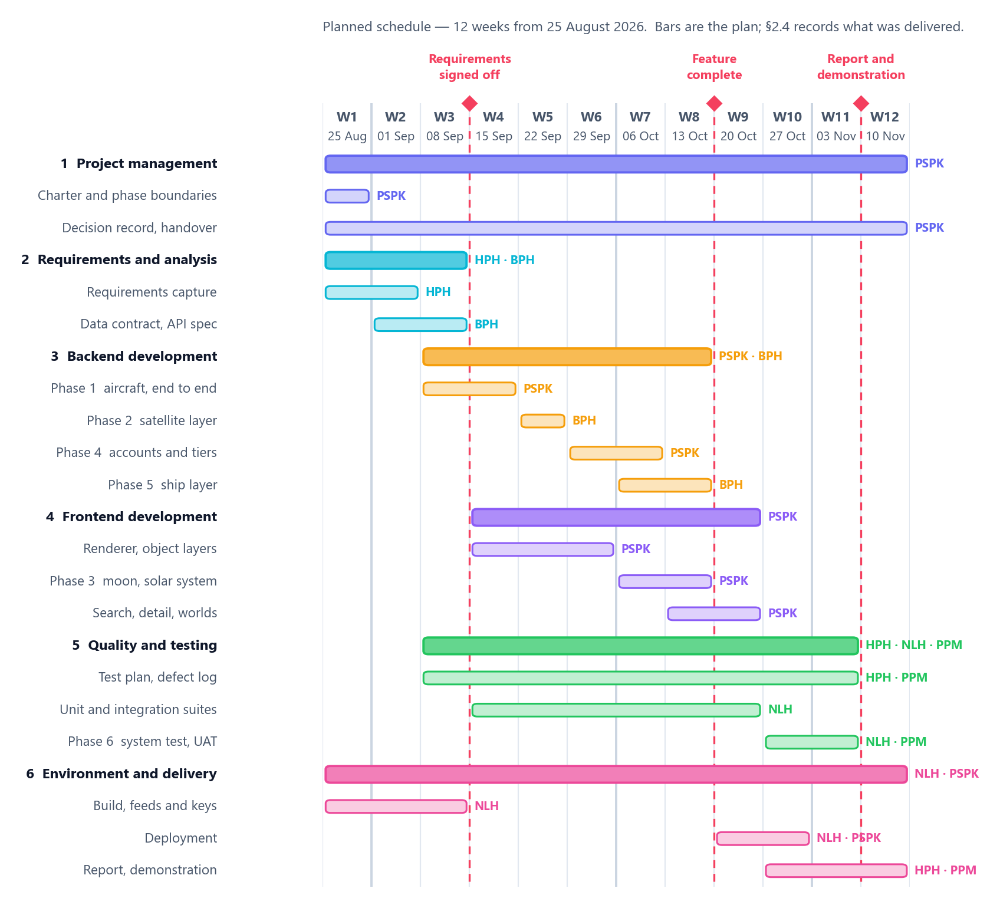

# Chapter 4: Project Planning

## 4.1 Project Charter

### Purpose

Orbital exists to put aircraft, ships and satellites on one map, in a browser,
for free, with no account required. The three kinds of object are already
tracked publicly and separately; nothing assembles them into a single view a
person can simply open.

### Objectives

| # | Objective | How it will be judged |
|---|---|---|
| O1 | One map showing all three object types | All three layers render live data from the deployed system |
| O2 | No account and no cost to look | The default view requires no sign-in and no payment |
| O3 | Upstream failure degrades, never breaks | With a feed disabled, the map still draws, labelled stale |
| O4 | A new object type costs one module | Adding a type requires no change to the API or the frontend |
| O5 | Honest reporting of what is shown | Sampling, staleness and source are stated in the interface |

### Scope

**In scope.** Ingestion from free public feeds; normalisation to one shared
shape; a read-only REST API; a browser client rendering the three layers on a
map; object selection and detail; search; accounts with a free and a premium
entitlement window; the Moon, the eight planets and the solar system view.

**Out of scope.** Writing to any upstream; historical archiving beyond the
retention window; native mobile applications; flight booking, ticketing or any
transaction; real-time alerting or push notification; an administrator
interface.

### Deliverables

The deployed application, the source repository with its test suites, this
report, a decision record, a test plan, and a demonstration.

### Constraints

| Constraint | Consequence for the plan |
|---|---|
| Free data sources only | Rate limits, not money, are the budget (§4.4) |
| No commercial licence on one feed | The revenue model cannot use OpenSky (§2.2) |
| One backend worker | Vertical scaling only; a second worker would double upstream cost |
| Five part-time students | Parallel work must be separable, or it serialises |
| One semester | Scope is fixed by phase boundaries rather than by deadline pressure |

### Assumptions

That the public feeds remain available and free; that their terms do not change
mid-project; that free hosting tiers remain sufficient for a demonstration
workload. **The first of these did not hold** — OpenSky became unreachable from
every cloud host partway through — and §4.6 treats it as the realised risk it
turned out to be rather than as an assumption that was merely unlucky.

### Authority

The Project Manager owns scope and phase boundaries and decides what is in the
current phase and what is explicitly out. Every significant decision is written
to the decision record with its alternatives and its reasoning, so that a choice
can be defended, or reversed, on the evidence that produced it.

---

## 4.2 Work Breakdown Structure

The work is broken down to the level at which one person owns one deliverable.
Decomposing further produces a task list that is stale within a week;
decomposing less leaves nobody accountable for anything.

{width=6.4in}

| WBS | Work package | Primary owner | Key deliverable |
|---|---|---|---|
| 1 | Project Management | Phone Sett Paing Kyaw | Decision record, phase boundaries, handover |
| 2 | Requirements and Analysis | Han Phyo Htet, Bhone Pyae Hein | Requirements, data contract, API specification |
| 3 | Backend Development | Phone Sett Paing Kyaw, Bhone Pyae Hein | Providers, poller, store, REST API, accounts |
| 4 | Frontend Development | Phone Sett Paing Kyaw | Map renderer, object layers, search, detail |
| 5 | Quality and Testing | Han Phyo Htet, Nyan Lin Htet, Pyae Phyo Maung | Test plan, suites, defect log, UAT |
| 6 | Environment and Delivery | Nyan Lin Htet | Build, feeds and keys, deployment, report |

**Package 3 is decomposed by phase rather than by component**, which is not the
conventional choice. A component breakdown — "the ingestion layer", "the API" —
would describe the architecture rather than the work, and would hide the fact
that most later packages touch the ingestion layer only by adding one file to
it. Breaking it down by delivered phase makes the actual shape of the effort
visible: each new object type is one provider module and one registry entry.

---

## 4.3 Project Schedule

{width=6.6in}

**This is the plan, not the log.** The bars are what the team undertook to do
and the order the dependencies allow. What was actually delivered, phase by
phase, is recorded in §2.4, and Chapter 8 is where the two are compared. Keeping
them apart matters: a Gantt chart redrawn after the fact to match what happened
is not a plan and cannot be used to judge whether planning worked.

### Milestones

| Milestone | Week | Condition for passing |
|---|---|---|
| M1 Requirements signed off | 3 | Data contract and API specification agreed by all three layers |
| M2 Feature complete | 8 | All three object layers render live; accounts and entitlements work |
| M3 Report and demonstration | 11 | Deployed system, report, test results, demonstration rehearsed |

### The critical path

Requirements → data contract → the first provider → the poller and store → the
API → the map renderer → the first layer on screen. Everything after that first
vertical slice is parallel: the satellite layer, the ship layer and the accounts
work each touch a different provider or a different route, and none of them
blocks another.

**That is a designed property, not a fortunate one.** The shared data shape was
specified before any provider was written precisely so that the second and third
object types would not sit behind the first. The measured evidence that it
worked is in §2.4: the ship layer cost the same as the satellite layer four
months later, and the polling logic was not modified for either.

### Scheduling assumption

The window is twelve weeks from **25 August 2026**, the date of the first
commit. If the module's submission date differs, the plan shifts with it — the
dependencies and durations do not change, only the calendar they are laid
against.

---

## 4.4 Cost Estimation

### Direct cost

| Category | Cost |
|---|---|
| Data sources | 0 |
| Map imagery and tiles | 0 |
| Libraries and tooling | 0 |
| Hosting, development and demonstration | 0 |
| **Total cash cost** | **0** |

Every input is a free public service or an open-source library, and both hosts
run on free tiers. This is not an accident of a student budget: §2.2 records
that free sources were a requirement, because a tracker that costs money per
viewer cannot be free to look at.

### The real budget is quota, not currency

No money changes hands, so the constraint that behaves like money is the
upstream request allowance. It was budgeted like money:

| Resource | Allowance | Planned use | Headroom |
|---|---|---|---|
| OpenSky daily credits | 4,000 | 3,072 (77%) | 928, for user-triggered lookups |
| adsb.lol request rate | Burst 4, then ~5/min | Within the measured limit | Enforced by a gate, not by convention |
| Celestrak / SatNOGS | Courtesy limits | Refreshed every six hours, cached to disk | Falls back to cache on failure |
| Ships (Digitraffic, aisstream) | No metered limit | Continuous websocket | — |

The startup refuses a configuration projected to exceed 85% of the OpenSky
allowance. A budget that is only written down is a budget nobody keeps; one the
program will not start without is a budget that holds.

### Labour, as a notional replacement cost

The project's only real cost is effort. Stated as what it would cost to buy,
under assumptions that are stated rather than implied:

| Item | Assumption |
|---|---|
| Team | 5 members |
| Duration | 12 weeks |
| Effort per member per week | 8 hours |
| **Total effort** | **480 person-hours** |

At a notional junior developer rate of **£25 per hour**, that is **£12,000** of
labour delivered at zero cash cost. The rate is an assumption for comparison
only; the hours are the figure worth arguing about, and they are an estimate,
not a measurement. The project did not keep timesheets, and inventing precise
ones here would be exactly the kind of invented number this report declines to
produce elsewhere.

---

## 4.5 Resource Planning

### People

| Member | Roles | Primary work packages |
|---|---|---|
| Phone Sett Paing Kyaw | Project Manager, Developer | 1, 3, 4 |
| Bhone Pyae Hein | System Analysis, Co-Developer | 2, 3 |
| Han Phyo Htet | Quality Assurance, Business Analysis | 2, 5, 6.4 |
| Nyan Lin Htet | Technical Engineer, Tester | 5, 6 |
| Pyae Phyo Maung | Co-Tester, Co-QA and Analysis | 5, 6.4 |

Seven roles across five people, so most members hold two. That is a
consequence of team size rather than a design: with five people, a role per
person would leave two roles unfilled, and the two that would go are quality
assurance and technical environment — the two whose absence is invisible until
late.

### Technology

| Resource | Purpose | Cost |
|---|---|---|
| Python, FastAPI, httpx, SGP4 | Ingestion and API | Free, open source |
| React, TypeScript, MapLibre GL, Vite | Browser client | Free, open source |
| SQLite | Accounts and sessions | Free, bundled |
| Vercel | Frontend and landing page hosting | Free tier |
| Northflank | Backend container hosting | Free tier |
| GitHub | Source control, history, issues | Free |

### Data

Five upstream feeds, all free and public: adsb.lol and adsb.fi for aircraft,
Celestrak and SatNOGS for orbital elements and satellite identity, Digitraffic
and aisstream for vessels. OpenSky remains supported in the code and is not
in use.

### Environment

A member must be able to set the project up from a clean machine. That is the
Technical Engineer's deliverable rather than a shared assumption, and it is the
reason generated assets are fetched by a script rather than committed: a clone
plus one command produces a running system, and a build with no network works
as long as a previous one has run.

---

## 4.6 Risk Management Plan

Probability and impact are graded **H/M/L**. The response column says what was
actually built or done, not what would ideally be done — a risk register of
intentions is a document nobody checks against the system.

| # | Risk | P | I | Response |
|---|---|---|---|---|
| R1 | An upstream feed becomes unavailable | H | H | Last good snapshot served with a visible staleness flag; aircraft and ships each have two independent feeds |
| R2 | An upstream rate-limits or bans the client | M | H | One backend for all viewers; measured limits enforced by a gate; exponential backoff honouring `Retry-After` |
| R3 | Secrets committed to the repository | L | H | Credentials in environment variables only; configuration never printed as an object, only field by field |
| R4 | Work serialises behind one member | M | M | The shared data shape fixed before any provider was written, so the layers proceed in parallel; handover written every session |
| R5 | A feed's licence forbids the intended use | M | M | Licences recorded per source; the commercial constraint is stated in §2.2 rather than assumed away |
| R6 | A defect resists diagnosis and consumes the schedule | M | H | Every defect written down with how it was found; a fix counts as fixed when demonstrated, not when written |
| R7 | Browser cannot draw the object count | M | H | Responses thinned to a cap; one layer at a time; positions interpolated between polls |
| R8 | Free hosting tier proves insufficient | M | M | One worker by design; everything answered from memory; scaling is a bigger box, not more boxes |
| R9 | A decision correct when made becomes wrong later | M | M | Decision record carries alternatives and reasoning, so a reversal is cheap and evidenced |

**Ordered by how much each one shaped the system, rather than by probability
times impact.** R1 to R4 are the four with a *structural* mitigation — something
in the architecture exists because of them. Feed loss is why a provider can be
two providers; rate limiting is why there is exactly one backend; secret
handling is why configuration is never printed as an object; and serialisation
risk is why the shared data shape was fixed before a line of ingestion was
written. The rest are managed by practice rather than by structure, which is a
weaker thing and is why they come second.

### R1 was realised, and the plan is judged on that

OpenSky became unreachable from every cloud host during the project. The
mitigation was not theoretical: a second aircraft feed was added, the union
provider kept the interface identical, and **nothing above the ingestion layer
changed**. The cost was one provider module and one registry entry — the same
cost the architecture had been designed to make it.

### R6 was also realised, and cost more

Six working sessions went to a single defect that was misdiagnosed five times.
The cause was structural — one camera serving two pictures at very different
scales — and the resolution deleted 376 lines, added 130, and cost no feature.
It is recorded here because a risk register that lists only the risks that were
survived cheaply is not a risk register.

---

## 4.7 Communication Plan

| Channel | Participants | Frequency | Purpose |
|---|---|---|---|
| Written handover | Whole team | End of every working session | What was done, what is blocked, who is waiting on whom |
| Decision record | Author, reviewed by PM | On every significant choice | The choice, its alternatives, and the reasoning |
| Defect log | QA, Testers, Developer | On every defect found | Severity, how it was found, whether it is fixed |
| Repository history | Whole team | Continuous | The change, and the reason for it, in the commit message |
| Team review | Whole team | Per phase boundary | Accept the phase, or state what is outstanding |
| Report and demonstration | Whole team, assessor | Milestone M3 | The deliverable |

### Why handover is a deliverable rather than a courtesy

The single largest risk to a part-time team is not technical: it is that context
is lost between sessions and re-derived at full cost. Every session therefore
ends with a written handover, and it is package 1.4 in the WBS with an owner
against it — because a practice that is only a good intention is a practice that
stops the first week somebody is busy.

### Escalation

A blocked item is raised in the handover. If it remains blocked at the next
session it goes to the Project Manager, who decides whether it is in the current
phase at all. **A blocker that is out of the phase is closed rather than
carried**, which is how the phase boundary does its job: the alternative is a
list that grows all semester and is resolved by the deadline rather than by
anyone.
