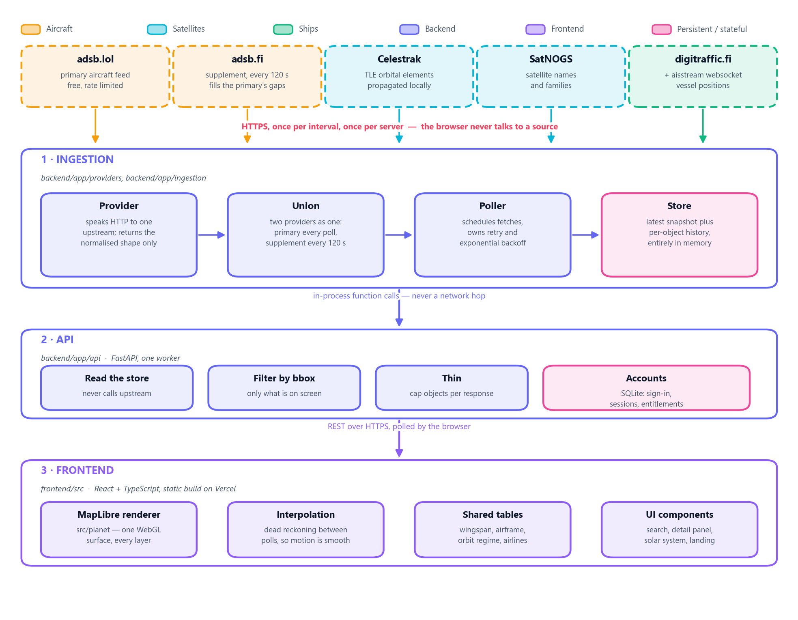
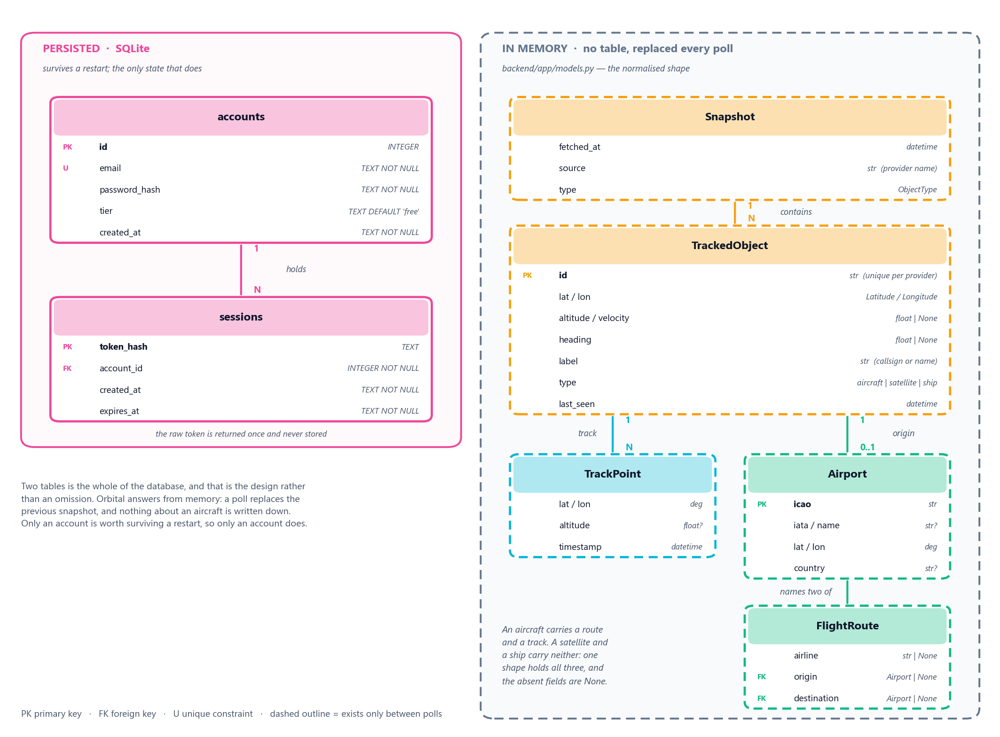
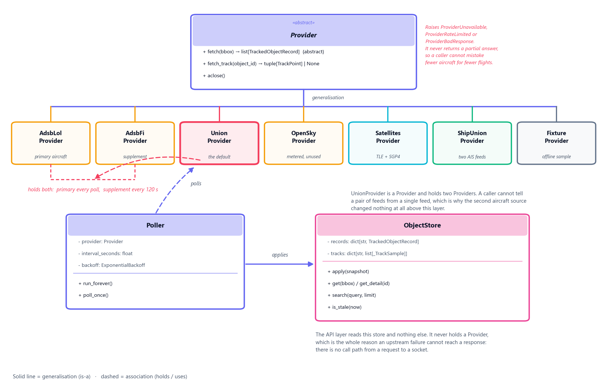
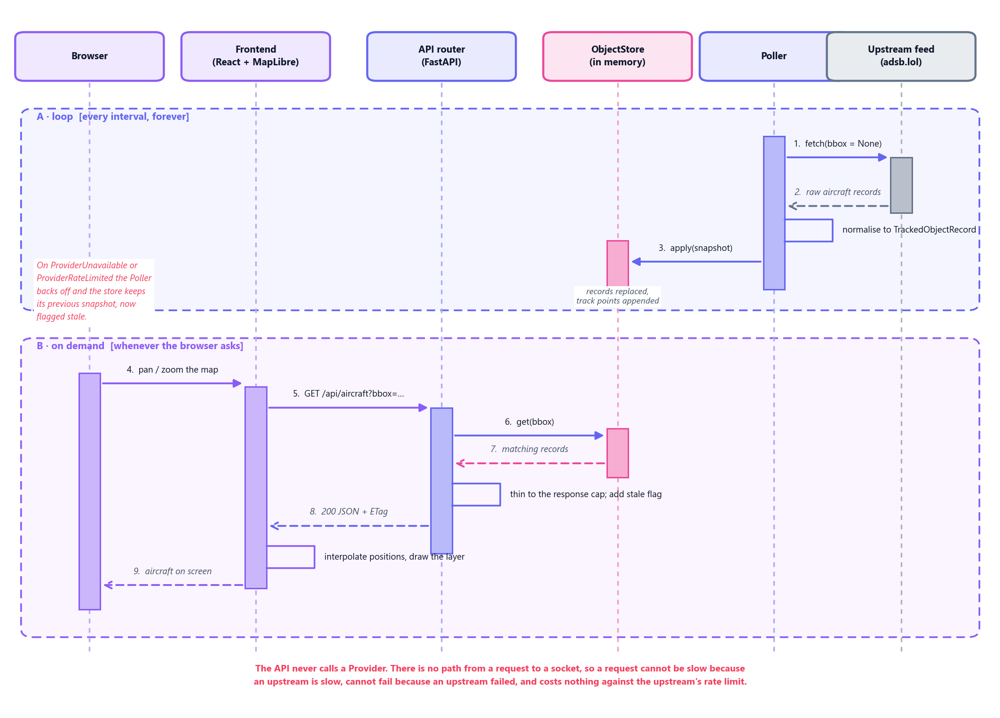
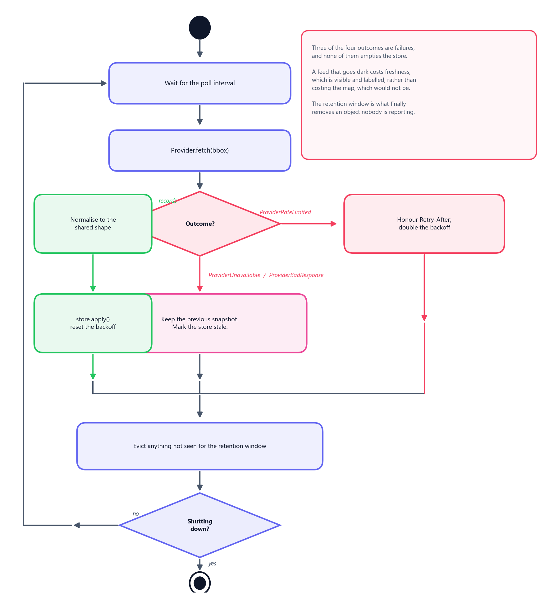
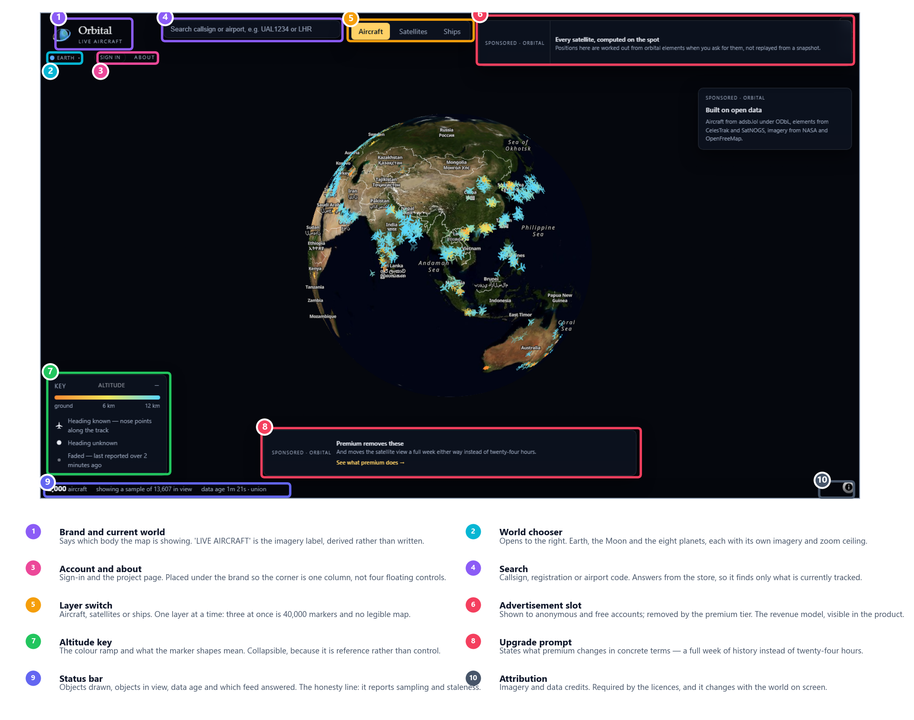

# Chapter 5: System Design

## 5.1 System Architecture

Orbital is three layers with one rule between them: **data flows in one
direction, and each layer knows only the layer directly beneath it.**

{width=6.5in}

### The three layers

| Layer | Owns | Never does |
|---|---|---|
| 1 Ingestion | Speaking to upstreams, normalising, scheduling, holding the current state | Know that a browser exists |
| 2 API | Reading the store, filtering by bounding box, thinning, accounts | Call an upstream |
| 3 Frontend | Rendering, interpolation, interaction | Know where the data came from |

### Three properties follow, and they are the design

**The browser never talks to a data source.** Every external call goes through
the backend, so rate limiting and caching are enforced in exactly one place. A
hundred open browser tabs cost the same upstream quota as one. This is what made
adding a second aircraft feed a backend-only change: the frontend was never
told, because there was nothing to tell it.

**Either end can be replaced without touching the other**, and both have been.
The backend gained a second upstream and the frontend gained an entirely
different renderer, neither requiring a change on the other side of the wire.

**Upstream failure is contained at layer 1.** The API serves the last good
snapshot with an explicit staleness flag. A feed outage degrades the display; it
does not break it.

### Deployment

| Component | Host | Shape |
|---|---|---|
| Frontend | Vercel | Static build, no server |
| Landing page | Vercel | `/landing`, the same deployment, static files |
| Backend | Northflank | One container, **one worker** |
| Accounts database | Northflank volume | SQLite file |

**One worker, deliberately.** The backend holds a websocket open to the AIS
stream, polls on a schedule, and answers every request from memory. A second
worker would open a second AIS socket, run its own poller and keep its own
store: the upstream cost would double and two requests could disagree about
where an aircraft is. It is scaled by making the box bigger, not by adding
boxes.

### The numbers that shape it

| Parameter | Value | Why that value |
|---|---|---|
| Objects per response | 2,000 | The cap above which the browser cannot draw a frame in budget |
| Object retention | 300 s | Longer than the longest poll interval, so a missed poll never drops an aircraft |
| Union supplement interval | 120 s | The metered feed answers once per interval regardless of the free feed's cadence |
| Aircraft request rate | 4 per minute | A fifth under the measured limit of burst-4 then ~5 per minute |
| Vessel ceiling | 14,000 | Bounds memory for a feed that accumulates rather than answers |

---

## 5.2 Database Design

{width=6.5in}

### Two tables, and that is the design

The persisted schema is `accounts` and `sessions`. Nothing else in Orbital is
written down.

```sql
CREATE TABLE accounts (
    id            INTEGER PRIMARY KEY AUTOINCREMENT,
    email         TEXT    NOT NULL UNIQUE,
    password_hash TEXT    NOT NULL,
    tier          TEXT    NOT NULL DEFAULT 'free',
    created_at    TEXT    NOT NULL
);

CREATE TABLE sessions (
    token_hash TEXT    PRIMARY KEY,
    account_id INTEGER NOT NULL,
    created_at TEXT    NOT NULL,
    expires_at TEXT    NOT NULL
);
CREATE INDEX sessions_account ON sessions (account_id);
```

An account holds many sessions: one per signed-in device, each expiring on its
own schedule.

**The raw session token is returned once, at creation, and never stored.** Only
its hash is in the table, so the token exists in the user's cookie and nowhere
else. A copy of the database does not let anyone sign in as anybody.

### Why almost nothing is persisted

A tracker looks like a system that should have a large database, and Orbital
deliberately does not. A poll replaces the previous snapshot; positions are held
in memory and served from there; an object not re-observed within the retention
window is evicted. Nothing about an aircraft is written to disk at all.

Three consequences, and all three are wanted:

- **The API cannot be slow because a database is slow**, because there is no
  database on the request path for tracked objects.
- **There is no schema migration** for the thing that changes most often — the
  shape of a feed — because a feed's shape is normalised at the boundary and
  never stored in its own form.
- **Restarting is cheap and safe.** The only state worth keeping is an account,
  and that is the only state kept.

The cost is equally plain: Orbital cannot answer a question about last Tuesday.
Entitlement windows of twenty-four hours and seven days are bounded by what is
still in memory, not by a query.

### The entities that have no table

`TrackedObject` is the shared shape all three object types normalise to, with
`TrackPoint`, `Airport` and `FlightRoute` hanging off it. They have real
structure, real relationships and real cardinality — they simply have no rows.
They are drawn dashed in Figure 5.2 because omitting them would make the data
model look like two tables about sign-in, which is the least interesting part of
this system.

**One shape holds all three object types, and the absent fields are `None`.** An
aircraft has a route and a track; a satellite and a ship have neither. This is
what makes a new object type cost one ingestion module: there is no per-type
schema to add.

---

## 5.3 UML Diagrams

### 5.3.1 Class Diagram

{width=6.5in}

The ingestion layer is the part of Orbital with real class structure, so it is
the part worth drawing. `Provider` is abstract and declares one required
operation: fetch, given an optional bounding box, and return the normalised
shape. Seven concrete providers implement it — one per upstream, plus an offline
fixture that needs no credentials.

**`UnionProvider` is the design point.** It inherits `Provider` *and holds two
of them*: the primary answers every poll, the supplement answers every 120
seconds, and the results are merged. A caller cannot tell a pair of feeds from a
single feed.

That is why the second aircraft source cost what it cost. When the primary
became unreachable from every cloud host, the change was one provider module and
one registry entry; the poller, the store, the API and the entire frontend were
untouched, because none of them can observe the difference.

`Provider` also raises rather than returning partial results —
`ProviderUnavailable`, `ProviderRateLimited`, `ProviderBadResponse`. A provider
that returned nine hundred aircraft instead of two thousand would be reporting
that the sky had emptied. Raising makes a failure a failure.

**The API never holds a `Provider`.** There is no call path from an HTTP request
to a socket, which is the structural reason §5.1's third property is true rather
than merely intended.

### 5.3.2 Sequence Diagram

{width=6.5in}

Two interactions are drawn on one page deliberately. Separately they look like
an ordinary background job and an ordinary request; together, the actual design
is visible — **they never touch.**

**A.** The poller wakes on its interval, asks the provider to fetch, normalises
what comes back, and applies it to the store. This runs whether or not anyone is
looking.

**B.** The browser pans the map and asks for a bounding box. The API reads the
store, filters, thins to the response cap, adds the staleness flag, and answers.
The frontend interpolates positions between polls so that motion is smooth at a
far lower request rate than smooth motion would otherwise need.

The browser's request does not trigger a fetch, does not wait for one, and
cannot fail because one failed. It reads whatever the store last had. That single
property is why an upstream outage degrades Orbital rather than breaking it, and
why viewer count is decoupled from upstream cost entirely.

### 5.3.3 Activity Diagram

{width=4.9in}

An activity diagram of the happy path would be a straight line and would say
nothing. The branches are the content: **three of the four outcomes of a fetch
are failures**, and what happens to each is the reason the map does not go blank
when a feed does.

| Outcome | Response |
|---|---|
| Records returned | Normalise, apply to the store, reset the backoff |
| `ProviderRateLimited` | Honour `Retry-After`, double the backoff, keep the snapshot |
| `ProviderUnavailable` | Keep the previous snapshot, mark the store stale |
| `ProviderBadResponse` | As above — a malformed answer is treated as no answer |

**None of the three failures empties the store.** A feed that goes dark costs
freshness, which is visible and labelled in the status bar, rather than costing
the map, which would not be. The retention window is what finally removes an
object that nobody is reporting — a decision made by elapsed time, not by one
failed request.

---

## 5.4 User Interface Design

{width=6.5in}

This is a screenshot of the running system rather than a wireframe. The counts
in the status bar — objects drawn, objects in view, data age, and which feed
answered — are the real ones at the moment of capture.

### The principles the layout follows

**The map is the product; everything else is chrome at the edges.** Controls
occupy the corners and the top strip. Nothing floats over the centre, because
the centre is the thing the user came for.

**One layer at a time.** Aircraft, satellites and ships are a switch rather than
three checkboxes. All three at once is roughly forty thousand markers and no
legible map; the switch makes that impossible rather than merely discouraged.

**The corner is one column, not four floating controls.** Brand, world chooser,
sign-in and about stack under one another, and the world chooser opens to the
right rather than downward so it does not cover the items beneath it.

**The status bar is the honesty line.** It states that 2,000 of 13,607 objects
in view are drawn, how old the data is, and which feed answered. A tracker that
quietly showed a sample as though it were everything would be easier to build
and would be lying.

**Colour carries meaning, and only meaning.** Altitude is a ramp; marker shape
distinguishes a known heading from an unknown one; a faded marker has not been
reported for over two minutes. The key states all three rather than expecting
the reader to infer them.

**The revenue model is visible in the product.** Advertisement slots are shown to
anonymous and free accounts and removed by the premium tier, and the upgrade
prompt says what premium changes in concrete terms — a full week of history
instead of twenty-four hours — rather than in adjectives.

---

## 5.5 Prototype Design

### What the prototype is

The prototype is the deployed system. There is no separate mock-up, and that is
a deliberate consequence of how the work was sequenced: the first phase
delivered one object type end to end — feed, normalisation, store, API, map,
marker on screen — rather than delivering a layer at a time across all three.

A vertical slice is a prototype that is also the first increment of the product.
The alternative, a horizontal one, produces a complete ingestion layer with
nothing to look at, and defers every integration risk to the end.

| | Address |
|---|---|
| Application | `orbital-liveview.vercel.app` |
| Landing page | `orbital-liveview.vercel.app/landing` |

### What each phase's prototype proved

| Phase | Prototype | The risk it retired |
|---|---|---|
| 1 | Aircraft, end to end | That a free feed could sustain a live map at all |
| 2 | Satellites; migration to MapLibre | That a second object type costs one module |
| 3 | Moon and solar system | That the renderer is not Earth-specific |
| 4 | Accounts, tiers, advertisements | That a revenue model fits without a payment integration |
| 5 | Ships, regional then global | That the shape holds for a streaming source, not just a polled one |
| 6 | Performance and defect sweep | That the whole thing holds at full object count |

### Evolution rather than throw-away

Each phase's prototype became the next phase's foundation, and none was
discarded. The evidence that this was the right shape is the cost of the later
phases: the satellite layer cost one provider module and one registry entry,
and the ship layer cost the same four months later, with the polling logic
unmodified for either.

**One prototype was discarded**, and it is worth recording. The original
renderer was a three.js globe, replaced by MapLibre in phase 2. The globe could
draw a sphere but could not draw a map: no vector basemap, no zoom to street
level, no established tiling. Replacing it cost a phase and was correct — a
decision that was right when it was made became wrong once the requirement grew
past what it could reach.
